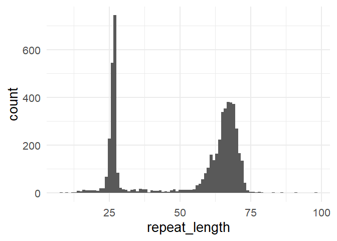

<!-- README.md is generated from README.Rmd. Please edit that file -->

# LevSTR

<!-- badges: start -->
<!-- badges: end -->

The goal of LevSTR is to estimate tandem repeat copy numbers in
sequencing data via Levenshtein distance metrics.

## Installation

You can install the development version of LevSTR from
[GitHub](https://github.com/) with:

``` r
# install.packages("pak")
pak::pak("Enjewl/LevSTR")
```

## Running the repeat sizer

The repeat sizer is a simple function that utilizes the
[agrep](https://www.rdocumentation.org/packages/base/versions/3.6.2/topics/agrep)
fuzzy matching to identify reads containing tandem repeats of interest.
The following parameters are required:

- **fastq** - Path to fastq file
- **left_flank_seq** - Left side sequence flanking the tandem repeat,
  example is given for Huntington’s disease CAG repeat (i.e., CAAGTCCTTC
  for Huntington’s disease CAG repeat)
- **right_flank_seq** - Right side sequence flanking the tandem repeat,
  example is given for Huntington’s disease CAG repeat (i.e.,
  CAACAGCCGCCACCG for Huntington’s disease CAG repeat)
- **repeat_unit_seq** - Sequence of the tandem repeat (i.e., CAG for
  Huntington’s disease)
- **max.distance** - Max Levenshtein distance allowed for match
- **min_n_repeats** - Minimum number of tandem repeats allowed for match
  (filters out sequences that contain less than this number of repeats)
- **interruptions_repeat_no** - Minimum number of sequential tandem
  repeats in matched sequence to allow
- **ignore_first_codon** - Ignores the first X number of codons in left
  flanking sequence to ignore when calculating repeats
- **ignore_last_codon** - Ignores the last X number of codons in right
  flanking sequence to ignore when calculating repeats
- **codon_start** - The codon starting position for matched sequence

``` r
suppressPackageStartupMessages(library(LevSTR))
#> Warning: package 'tibble' was built under R version 4.4.3
#> Warning: package 'stringr' was built under R version 4.4.3
#> Warning: package 'data.table' was built under R version 4.4.3

Matched_sequence_df <- Lev_repeat_sizer(
  fastq = fastq_example,
  left_flank_seq = "CAAGTCCTTC",
  right_flank_seq = "CAACAGCCGCCACCG",
  repeat_unit_seq = "CAG",
  max.distance = 0.04,
  min_n_repeats = 10,
  interruptions_repeat_no = 2,
  ignore_first_codon = 2,
  ignore_last_codon = 1,
  codon_start = 2)
```

## Plotting

Use the LevSTR::LevPlot plotting function to plot a basic histogram.

``` r
invisible(LevPlot(Matched_sequence_df, xlim = c(0,100)))
```


## Fancy plots

You can use ggplot to make fancier plots.

``` r
library(ggplot2)
#> Warning: package 'ggplot2' was built under R version 4.4.3
ggplot(Matched_sequence_df, aes(repeat_length)) +
  geom_histogram(binwidth = 1) +
  theme_minimal(base_size = 20)
```


