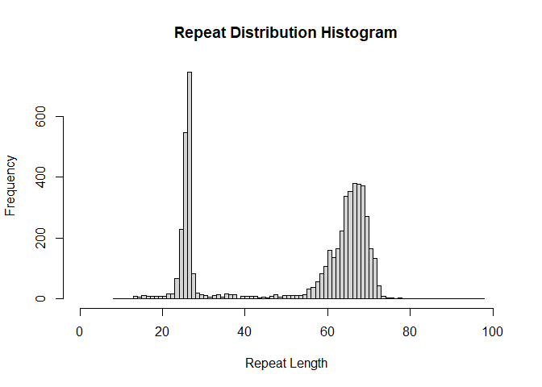

<!-- README.md is generated from README.Rmd. Please edit that file -->

# LevSTR

<!-- badges: start -->
<!-- badges: end -->

The goal of LevSTR is to estimate tandem repeat copy numbers in
sequencing data via Levenshtein distance metrics.

## Installation

You can install the development version of LevSTR from
[GitHub](https://github.com/) with:

``` r
# install.packages("pak")
pak::pak("Enjewl/Lev-STR")
```

## Example

This is a basic example which shows you how to solve a common problem:

``` r
library(LevSTR)
#> Loading required package: microseq
#> Loading required package: tibble
#> Loading required package: stringr
#> Loading required package: dplyr
#> 
#> Attaching package: 'dplyr'
#> The following objects are masked from 'package:stats':
#> 
#>     filter, lag
#> The following objects are masked from 'package:base':
#> 
#>     intersect, setdiff, setequal, union
#> Loading required package: data.table
#> 
#> Attaching package: 'data.table'
#> The following objects are masked from 'package:dplyr':
#> 
#>     between, first, last
#> Loading required package: rlang
#> 
#> Attaching package: 'rlang'
#> The following object is masked from 'package:data.table':
#> 
#>     :=
#> 
#> Attaching package: 'microseq'
#> The following object is masked from 'package:base':
#> 
#>     gregexpr
#> Loading required package: purrr
#> 
#> Attaching package: 'purrr'
#> The following objects are masked from 'package:rlang':
#> 
#>     %@%, flatten, flatten_chr, flatten_dbl, flatten_int, flatten_lgl,
#>     flatten_raw, invoke, splice
#> The following object is masked from 'package:data.table':
#> 
#>     transpose
## basic example code
Matched_sequence_df <- Lev_repeat_sizer(fastq_example)
LevPlot(Matched_sequence_df, xlim = c(0,100))
```


    #> $breaks
    #>  [1]  8  9 10 11 12 13 14 15 16 17 18 19 20 21 22 23 24 25 26 27 28 29 30 31 32
    #> [26] 33 34 35 36 37 38 39 40 41 42 43 44 45 46 47 48 49 50 51 52 53 54 55 56 57
    #> [51] 58 59 60 61 62 63 64 65 66 67 68 69 70 71 72 73 74 75 76 77 78 79 80 81 82
    #> [76] 83 84 85 86 87 88 89 90 91 92 93 94 95 96 97 98
    #> 
    #> $counts
    #>  [1]   2   2   0   2   2   8   6  12  10  10  10  10   8  18  18  68 228 546 744
    #> [20]  84  20  14  12   6  12  14   6  16  14  14   2  10   8   8  10   4   6   4
    #> [39]  10  14   6  12  12  12  12  12  14  32  38  56  82 106 160 136 164 224 338
    #> [58] 354 380 378 372 270 166 134  42  10   4   4   2   4   2   0   0   0   2   0
    #> [77]   0   2   0   0   0   0   2   0   0   0   0   0   0   2
    #> 
    #> $density
    #>  [1] 0.0003611412 0.0003611412 0.0000000000 0.0003611412 0.0003611412
    #>  [6] 0.0014445648 0.0010834236 0.0021668472 0.0018057060 0.0018057060
    #> [11] 0.0018057060 0.0018057060 0.0014445648 0.0032502709 0.0032502709
    #> [16] 0.0122788010 0.0411700975 0.0985915493 0.1343445287 0.0151679307
    #> [21] 0.0036114121 0.0025279884 0.0021668472 0.0010834236 0.0021668472
    #> [26] 0.0025279884 0.0010834236 0.0028891296 0.0025279884 0.0025279884
    #> [31] 0.0003611412 0.0018057060 0.0014445648 0.0014445648 0.0018057060
    #> [36] 0.0007222824 0.0010834236 0.0007222824 0.0018057060 0.0025279884
    #> [41] 0.0010834236 0.0021668472 0.0021668472 0.0021668472 0.0021668472
    #> [46] 0.0021668472 0.0025279884 0.0057782593 0.0068616829 0.0101119538
    #> [51] 0.0148067895 0.0191404839 0.0288912965 0.0245576020 0.0296135789
    #> [56] 0.0404478151 0.0610328638 0.0639219935 0.0686168292 0.0682556880
    #> [61] 0.0671722644 0.0487540628 0.0299747201 0.0241964608 0.0075839653
    #> [66] 0.0018057060 0.0007222824 0.0007222824 0.0003611412 0.0007222824
    #> [71] 0.0003611412 0.0000000000 0.0000000000 0.0000000000 0.0003611412
    #> [76] 0.0000000000 0.0000000000 0.0003611412 0.0000000000 0.0000000000
    #> [81] 0.0000000000 0.0000000000 0.0003611412 0.0000000000 0.0000000000
    #> [86] 0.0000000000 0.0000000000 0.0000000000 0.0000000000 0.0003611412
    #> 
    #> $mids
    #>  [1]  8.5  9.5 10.5 11.5 12.5 13.5 14.5 15.5 16.5 17.5 18.5 19.5 20.5 21.5 22.5
    #> [16] 23.5 24.5 25.5 26.5 27.5 28.5 29.5 30.5 31.5 32.5 33.5 34.5 35.5 36.5 37.5
    #> [31] 38.5 39.5 40.5 41.5 42.5 43.5 44.5 45.5 46.5 47.5 48.5 49.5 50.5 51.5 52.5
    #> [46] 53.5 54.5 55.5 56.5 57.5 58.5 59.5 60.5 61.5 62.5 63.5 64.5 65.5 66.5 67.5
    #> [61] 68.5 69.5 70.5 71.5 72.5 73.5 74.5 75.5 76.5 77.5 78.5 79.5 80.5 81.5 82.5
    #> [76] 83.5 84.5 85.5 86.5 87.5 88.5 89.5 90.5 91.5 92.5 93.5 94.5 95.5 96.5 97.5
    #> 
    #> $xname
    #> [1] "table_of_repeats[, column_name]"
    #> 
    #> $equidist
    #> [1] TRUE
    #> 
    #> attr(,"class")
    #> [1] "histogram"

What is special about using `README.Rmd` instead of just `README.md`?
You can include R chunks like so:

``` r
summary(cars)
#>      speed           dist       
#>  Min.   : 4.0   Min.   :  2.00  
#>  1st Qu.:12.0   1st Qu.: 26.00  
#>  Median :15.0   Median : 36.00  
#>  Mean   :15.4   Mean   : 42.98  
#>  3rd Qu.:19.0   3rd Qu.: 56.00  
#>  Max.   :25.0   Max.   :120.00
```

You’ll still need to render `README.Rmd` regularly, to keep `README.md`
up-to-date. `devtools::build_readme()` is handy for this.

You can also embed plots, for example:



    #> $breaks
    #>  [1]  8  9 10 11 12 13 14 15 16 17 18 19 20 21 22 23 24 25 26 27 28 29 30 31 32
    #> [26] 33 34 35 36 37 38 39 40 41 42 43 44 45 46 47 48 49 50 51 52 53 54 55 56 57
    #> [51] 58 59 60 61 62 63 64 65 66 67 68 69 70 71 72 73 74 75 76 77 78 79 80 81 82
    #> [76] 83 84 85 86 87 88 89 90 91 92 93 94 95 96 97 98
    #> 
    #> $counts
    #>  [1]   2   2   0   2   2   8   6  12  10  10  10  10   8  18  18  68 228 546 744
    #> [20]  84  20  14  12   6  12  14   6  16  14  14   2  10   8   8  10   4   6   4
    #> [39]  10  14   6  12  12  12  12  12  14  32  38  56  82 106 160 136 164 224 338
    #> [58] 354 380 378 372 270 166 134  42  10   4   4   2   4   2   0   0   0   2   0
    #> [77]   0   2   0   0   0   0   2   0   0   0   0   0   0   2
    #> 
    #> $density
    #>  [1] 0.0003611412 0.0003611412 0.0000000000 0.0003611412 0.0003611412
    #>  [6] 0.0014445648 0.0010834236 0.0021668472 0.0018057060 0.0018057060
    #> [11] 0.0018057060 0.0018057060 0.0014445648 0.0032502709 0.0032502709
    #> [16] 0.0122788010 0.0411700975 0.0985915493 0.1343445287 0.0151679307
    #> [21] 0.0036114121 0.0025279884 0.0021668472 0.0010834236 0.0021668472
    #> [26] 0.0025279884 0.0010834236 0.0028891296 0.0025279884 0.0025279884
    #> [31] 0.0003611412 0.0018057060 0.0014445648 0.0014445648 0.0018057060
    #> [36] 0.0007222824 0.0010834236 0.0007222824 0.0018057060 0.0025279884
    #> [41] 0.0010834236 0.0021668472 0.0021668472 0.0021668472 0.0021668472
    #> [46] 0.0021668472 0.0025279884 0.0057782593 0.0068616829 0.0101119538
    #> [51] 0.0148067895 0.0191404839 0.0288912965 0.0245576020 0.0296135789
    #> [56] 0.0404478151 0.0610328638 0.0639219935 0.0686168292 0.0682556880
    #> [61] 0.0671722644 0.0487540628 0.0299747201 0.0241964608 0.0075839653
    #> [66] 0.0018057060 0.0007222824 0.0007222824 0.0003611412 0.0007222824
    #> [71] 0.0003611412 0.0000000000 0.0000000000 0.0000000000 0.0003611412
    #> [76] 0.0000000000 0.0000000000 0.0003611412 0.0000000000 0.0000000000
    #> [81] 0.0000000000 0.0000000000 0.0003611412 0.0000000000 0.0000000000
    #> [86] 0.0000000000 0.0000000000 0.0000000000 0.0000000000 0.0003611412
    #> 
    #> $mids
    #>  [1]  8.5  9.5 10.5 11.5 12.5 13.5 14.5 15.5 16.5 17.5 18.5 19.5 20.5 21.5 22.5
    #> [16] 23.5 24.5 25.5 26.5 27.5 28.5 29.5 30.5 31.5 32.5 33.5 34.5 35.5 36.5 37.5
    #> [31] 38.5 39.5 40.5 41.5 42.5 43.5 44.5 45.5 46.5 47.5 48.5 49.5 50.5 51.5 52.5
    #> [46] 53.5 54.5 55.5 56.5 57.5 58.5 59.5 60.5 61.5 62.5 63.5 64.5 65.5 66.5 67.5
    #> [61] 68.5 69.5 70.5 71.5 72.5 73.5 74.5 75.5 76.5 77.5 78.5 79.5 80.5 81.5 82.5
    #> [76] 83.5 84.5 85.5 86.5 87.5 88.5 89.5 90.5 91.5 92.5 93.5 94.5 95.5 96.5 97.5
    #> 
    #> $xname
    #> [1] "table_of_repeats[, column_name]"
    #> 
    #> $equidist
    #> [1] TRUE
    #> 
    #> attr(,"class")
    #> [1] "histogram"

In that case, don’t forget to commit and push the resulting figure
files, so they display on GitHub and CRAN.
